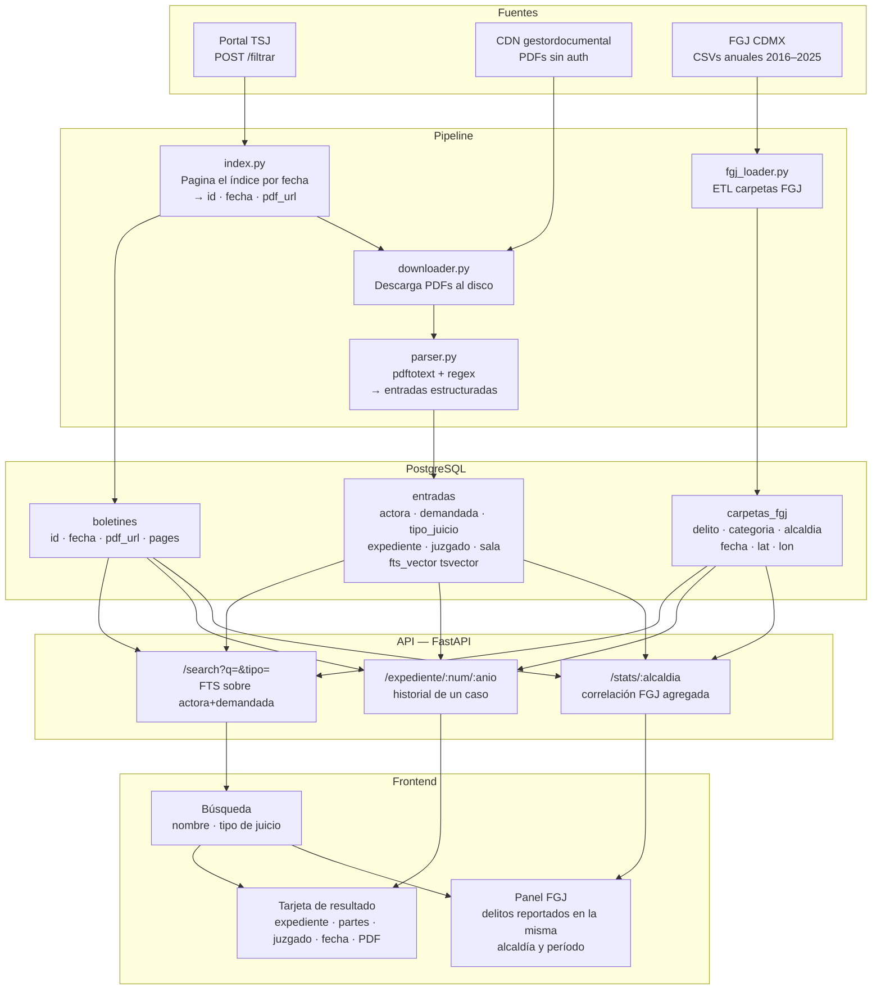

# Arquitectura — boletin-judicial-cdmx

## Diagrama general



---

## Componentes

### Pipeline de datos

#### `scraper/index.py`
Pagina el índice del portal TSJ enviando POST a `/consultaboletinpjcdmx/filtrar` con rangos de fechas. Extrae por cada boletín: ID interno, fecha y URL del PDF. Guarda en la tabla `boletines`.

Consideraciones:
- Requiere sesión con CSRF token (se obtiene en el GET previo).
- IDs incrementan de 2 en 2 por día hábil. El corpus actual va del ID ~279 (2017) al ~4002 (jun 2026): aproximadamente 2000 boletines.
- Los PDFs viven en `gestordocumental.poderjudicialcdmx.gob.mx` (Cloudflare CDN, sin autenticación).

#### `scraper/downloader.py`
Descarga cada PDF al disco usando la URL extraída. Saltea los ya descargados. Estimado: ~15 GB para el histórico completo.

#### `scraper/parser.py`
Convierte cada PDF a texto con `pdftotext` (funciona a pesar del cifrado AES-256 del archivo). Divide el texto por sección de juzgado y parsea cada entrada con regex.

Formato de entrada en el boletín:
```
[Actora] vs. [Demandada]. [Tipo de juicio] [M.] [N] Acdo(s). Núm. Exp. [NNNN/YYYY].
```

Campos extraídos: `actora`, `demandada`, `tipo_juicio`, `num_acdos`, `expediente`, `juzgado`, `sala`, `secretaria`, `fecha_acuerdo`. El texto completo de la entrada se guarda en `raw_text` como fallback.

#### `loader/fgj_loader.py`
Descarga los CSVs anuales de carpetas de investigación de la FGJ desde `archivo.datos.cdmx.gob.mx`. Los carga en la tabla `carpetas_fgj`. Fuente: [datos.cdmx.gob.mx](https://datos.cdmx.gob.mx/dataset/carpetas-de-investigacion-fgj-de-la-ciudad-de-mexico).

---

### Base de datos — PostgreSQL

```sql
CREATE TABLE boletines (
    id          INTEGER PRIMARY KEY,  -- ID del portal (/externo/{id})
    fecha       DATE NOT NULL,
    pdf_url     TEXT,
    pages       INTEGER,
    parsed_at   TIMESTAMP
);

CREATE TABLE entradas (
    id           SERIAL PRIMARY KEY,
    boletin_id   INTEGER REFERENCES boletines(id),
    fecha        DATE NOT NULL,
    juzgado      TEXT,
    sala         TEXT,
    secretaria   TEXT,
    actora       TEXT,
    demandada    TEXT,
    tipo_juicio  TEXT,
    expediente   TEXT,               -- e.g. "103/2026"
    num_acdos    INTEGER,
    raw_text     TEXT,
    fts_vector   TSVECTOR
);

CREATE INDEX entradas_fts ON entradas USING GIN(fts_vector);

-- fts_vector se actualiza con:
-- to_tsvector('spanish', coalesce(actora,'') || ' ' || coalesce(demandada,'') || ' ' || coalesce(tipo_juicio,''))

CREATE TABLE carpetas_fgj (
    id                SERIAL PRIMARY KEY,
    fecha_inicio      DATE,
    fecha_hecho       DATE,
    delito            TEXT,
    categoria_delito  TEXT,
    competencia       TEXT,
    fiscalia          TEXT,
    alcaldia          TEXT,
    colonia           TEXT,
    lat               FLOAT,
    lon               FLOAT
);

CREATE INDEX carpetas_fgj_alcaldia ON carpetas_fgj (alcaldia, fecha_hecho);
```

---

### API — FastAPI

| Endpoint | Descripción |
|---|---|
| `GET /search?q=&tipo=` | Búsqueda FTS por nombre o texto libre. Filtro opcional por `tipo_juicio`. |
| `GET /expediente/{num}/{anio}` | Historial de acuerdos de un expediente. |
| `GET /stats/{alcaldia}` | Agregados FGJ por alcaldía y período: delitos reportados vs. casos en juzgado. |

#### Nota sobre la correlación FGJ

Las dos fuentes no comparten una clave directa. La correlación es estadística:

- El juzgado en cada entrada del boletín tiene sede fija en una alcaldía → permite agrupar casos por alcaldía.
- Se mapea `tipo_juicio` a categorías FGJ (ej. "Ejecutivo Mercantil" → fraude patrimonial).
- El endpoint `/stats` devuelve el volumen de carpetas FGJ abiertas en la misma alcaldía y período, filtradas por categoría de delito relacionada.

---

### Frontend

Interfaz estática o SSR ligera. Componentes principales:

- **Buscador**: campo de texto libre + selector de tipo de juicio.
- **Tarjeta de resultado**: expediente, partes, juzgado, fecha, enlace al PDF original.
- **Panel FGJ**: contexto de carpetas de investigación para la alcaldía y período del caso.

Tecnología: pendiente de definir.

---

## Decisiones pendientes

- [ ] Tecnología del frontend
- [ ] Hosting y base de datos (VPS propio vs. servicio externo)
- [ ] Alcance del histórico (¿desde 2017 o solo desde 2020?)
- [ ] Estrategia de actualización diaria (cron vs. webhook)
