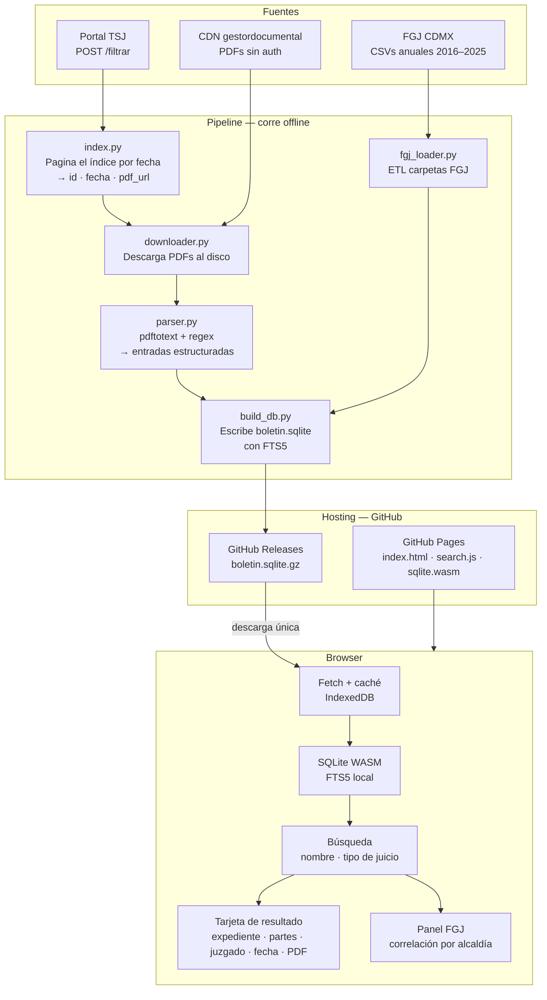

# Arquitectura — boletin-judicial-cdmx

## Diagrama general



---

## Componentes

### Pipeline de datos

#### `scraper/index.py`
Pagina el índice del portal TSJ enviando POST a `/consultaboletinpjcdmx/filtrar` con rangos de fechas. Extrae por cada boletín: ID interno, fecha y URL del PDF. Guarda en la tabla `boletines`.

Consideraciones:
- Requiere sesión con CSRF token (se obtiene en el GET previo).
- IDs incrementan de 2 en 2 por día hábil. El corpus actual va del ID ~279 (2017) al ~4002 (jun 2026): aproximadamente 2000 boletines.
- Los PDFs viven en `gestordocumental.poderjudicialcdmx.gob.mx` (Cloudflare CDN, sin autenticación).

#### `scraper/downloader.py`
Descarga cada PDF al disco usando la URL extraída. Saltea los ya descargados. Estimado: ~15 GB para el histórico completo.

#### `scraper/parser.py`
Convierte cada PDF a texto con `pdftotext` (funciona a pesar del cifrado AES-256 del archivo). Divide el texto por sección de juzgado y parsea cada entrada con regex.

Formato de entrada en el boletín:
```
[Actora] vs. [Demandada]. [Tipo de juicio] [M.] [N] Acdo(s). Núm. Exp. [NNNN/YYYY].
```

Campos extraídos: `actora`, `demandada`, `tipo_juicio`, `num_acdos`, `expediente`, `juzgado`, `sala`, `secretaria`, `fecha_acuerdo`. El texto completo de la entrada se guarda en `raw_text` como fallback.

#### `loader/fgj_loader.py`
Descarga los CSVs anuales de carpetas de investigación de la FGJ desde `archivo.datos.cdmx.gob.mx`. Los carga en la tabla `carpetas_fgj`. Fuente: [datos.cdmx.gob.mx](https://datos.cdmx.gob.mx/dataset/carpetas-de-investigacion-fgj-de-la-ciudad-de-mexico).

---

### Base de datos — SQLite con FTS5

Un único archivo `boletin.sqlite` generado offline por `build_db.py`. Sin servidor.

```sql
CREATE TABLE boletines (
    id        INTEGER PRIMARY KEY,  -- ID del portal (/externo/{id})
    fecha     TEXT NOT NULL,
    pdf_url   TEXT,
    pages     INTEGER
);

CREATE TABLE entradas (
    id          INTEGER PRIMARY KEY,
    boletin_id  INTEGER REFERENCES boletines(id),
    fecha       TEXT,
    juzgado     TEXT,
    sala        TEXT,
    secretaria  TEXT,
    actora      TEXT,
    demandada   TEXT,
    tipo_juicio TEXT,
    expediente  TEXT,
    num_acdos   INTEGER
    -- sin raw_text para mantener el tamaño manejable
);

-- Clave real de un expediente: (juzgado, expediente)
CREATE INDEX idx_expediente ON entradas (juzgado, expediente);

-- FTS5 sobre nombres de partes
CREATE VIRTUAL TABLE entradas_fts USING fts5(
    actora, demandada, tipo_juicio,
    content='entradas', content_rowid='id'
);

CREATE TABLE carpetas_fgj (
    id               INTEGER PRIMARY KEY,
    fecha_inicio     TEXT,
    fecha_hecho      TEXT,
    delito           TEXT,
    categoria_delito TEXT,
    fiscalia         TEXT,
    alcaldia         TEXT,
    colonia          TEXT,
    lat              REAL,
    lon              REAL
);

CREATE INDEX idx_fgj_alcaldia ON carpetas_fgj (alcaldia, fecha_hecho);
```

---

### Frontend — sin servidor

**Hosting:**
- GitHub Pages sirve el HTML, JS y el binario `sqlite.wasm`.
- GitHub Releases aloja `boletin.sqlite.gz` (soporta hasta 2 GB por archivo).

**En el browser:**
1. Primer acceso: descarga `boletin.sqlite.gz` desde Releases, descomprime, guarda en IndexedDB.
2. Accesos siguientes: carga desde IndexedDB (sin red).
3. Todas las búsquedas corren con SQLite WASM + FTS5 localmente.

**Búsquedas:**
```sql
-- Por nombre
SELECT * FROM entradas JOIN entradas_fts ON entradas.id = entradas_fts.rowid
WHERE entradas_fts MATCH 'garcia lopez'
  AND tipo_juicio LIKE '%Civil%'
LIMIT 50;

-- Por expediente (clave compuesta)
SELECT * FROM entradas
WHERE juzgado = 'CUARTO DE LO CIVIL' AND expediente = '103/2026';

-- Correlación FGJ
SELECT categoria_delito, COUNT(*) FROM carpetas_fgj
WHERE alcaldia = 'Cuauhtémoc'
  AND fecha_hecho BETWEEN '2024-01-01' AND '2024-12-31'
GROUP BY categoria_delito ORDER BY 2 DESC;
```

#### Nota sobre la correlación FGJ

Las dos fuentes no comparten una clave directa. La correlación es estadística:
- El juzgado en cada entrada tiene sede fija en una alcaldía → permite agrupar por alcaldía.
- Se mapea `tipo_juicio` a categorías FGJ (ej. "Ejecutivo Mercantil" → fraude patrimonial).
- La UI muestra el volumen de carpetas FGJ en la misma alcaldía y período como contexto del resultado.

---

## Decisiones tomadas

- Frontend estático en GitHub Pages, sin backend ni API
- Base de datos SQLite con FTS5, generada offline
- DB publicada en GitHub Releases, descargada y cacheada en el browser (IndexedDB)
- Búsquedas 100% en cliente con SQLite WASM
- Clave de expediente: `(juzgado, expediente)` — el número solo no es único en el corpus

## Decisiones pendientes

- [ ] Alcance del histórico (¿desde 2017 o desde 2020?)
- [ ] Estrategia de actualización (frecuencia, quién corre el pipeline, cómo se publica el nuevo release)
