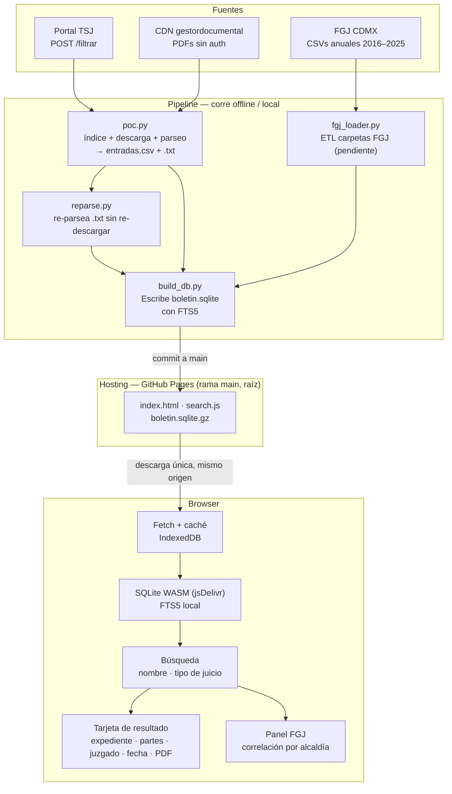

# Arquitectura — boletin-judicial-cdmx

## Diagrama general



---

## Componentes

### Pipeline de datos

> Nota: el PoC unificó índice, descarga y parseo en un solo script (`poc.py`) en vez de los tres módulos separados que se plantearon originalmente. Lo que sigue describe la implementación real.

#### `scraper/poc.py`
Hace todo el scraping en un paso, por rango de fechas. Para cada boletín:
1. **Índice** — GET para el CSRF token, luego POST a `/consultaboletinpjcdmx/filtrar`. Extrae ID interno, fecha y URL del PDF.
2. **Descarga** — baja el PDF al disco (saltea los ya descargados), guarda también la versión en texto (`.txt`).
3. **Parseo** — `pdftotext` (sin `-layout`) + regex extraen las entradas estructuradas.

Salida en `scraper/data/<fecha-run>/`: `index.json`, `pdfs/boletin_<id>.pdf` + `.txt`, `entradas.csv`, `resumen.json`, `search_index.json`.

Consideraciones:
- IDs incrementan de 2 en 2 por día hábil. El corpus va del ID ~279 (2017) al ~4002 (jun 2026): ~2000 boletines.
- Los PDFs viven en `gestordocumental.poderjudicialcdmx.gob.mx` (Cloudflare CDN, sin autenticación) y tienen cifrado AES-256, pero `pdftotext` los lee igual.

Formato de entrada en el boletín:
```
[Actora] vs. [Demandada]. [Tipo de juicio] [M.] [N] Acdo(s). Núm. Exp. [NNNN/YYYY].
```

Campos extraídos: `actora`, `demandada`, `tipo_juicio`, `num_acdos`, `expediente`, `juzgado`, `sala`, `secretaria`, `fecha_acuerdo`. Detalle del parseo en `scraper/PARSEO.md`.

#### `scraper/reparse.py`
Re-parsea los `.txt` ya descargados y reescribe `entradas.csv`, sin volver a bajar PDFs ni llamar a `pdftotext`. Se usa cuando se cambia la lógica de parseo de `poc.py`:
```bash
python scraper/reparse.py scraper/data/2026-06-10
```

#### `loader/fgj_loader.py`
Descarga los CSVs anuales de carpetas de investigación de la FGJ desde `archivo.datos.cdmx.gob.mx`. Los carga en la tabla `carpetas_fgj`. Fuente: [datos.cdmx.gob.mx](https://datos.cdmx.gob.mx/dataset/carpetas-de-investigacion-fgj-de-la-ciudad-de-mexico).

---

### Base de datos — SQLite con FTS5

Un único archivo `boletin.sqlite` generado offline por `build_db.py`. Sin servidor.

```sql
CREATE TABLE boletines (
    id        INTEGER PRIMARY KEY,  -- ID del portal (/externo/{id})
    fecha     TEXT NOT NULL,
    pdf_url   TEXT,
    pages     INTEGER
);

CREATE TABLE entradas (
    id          INTEGER PRIMARY KEY,
    boletin_id  INTEGER REFERENCES boletines(id),
    fecha       TEXT,
    juzgado     TEXT,
    sala        TEXT,
    secretaria  TEXT,
    actora      TEXT,
    demandada   TEXT,
    tipo_juicio TEXT,
    expediente  TEXT,
    num_acdos   INTEGER
    -- sin raw_text para mantener el tamaño manejable
);

-- Clave real de un expediente: (juzgado, expediente)
CREATE INDEX idx_expediente ON entradas (juzgado, expediente);

-- FTS5 sobre nombres de partes
CREATE VIRTUAL TABLE entradas_fts USING fts5(
    actora, demandada, tipo_juicio,
    content='entradas', content_rowid='id'
);

CREATE TABLE carpetas_fgj (
    id               INTEGER PRIMARY KEY,
    fecha_inicio     TEXT,
    fecha_hecho      TEXT,
    delito           TEXT,
    categoria_delito TEXT,
    fiscalia         TEXT,
    alcaldia         TEXT,
    colonia          TEXT,
    lat              REAL,
    lon              REAL
);

CREATE INDEX idx_fgj_alcaldia ON carpetas_fgj (alcaldia, fecha_hecho);
```

---

### Frontend — sin servidor

**Hosting:**
- GitHub Pages sirve todo desde la **raíz de la rama `main`**: `index.html`, `search.js` y `boletin.sqlite.gz`. Configuración de Pages: *Deploy from a branch* → `main` / `/ (root)`. Un `.nojekyll` evita el procesado Jekyll.
- El binario `sql-wasm.wasm` y el loader `sql-wasm.js` se cargan desde **jsDelivr** (`cdn.jsdelivr.net/npm/sql.js`). Importante: este build incluye FTS5; el de cdnjs **no** lo trae y la búsqueda falla con `no such module: fts5`.
- `boletin.sqlite.gz` (~84 MB para 64 boletines) se commitea directo a `main`. Está por debajo del límite duro de 100 MB de GitHub (genera un warning a partir de 50 MB, pero se acepta). Si la DB crece más allá de 100 MB habrá que migrar a Git LFS o fragmentarla.

**Por qué no GitHub Releases:** Releases redirige con 302 y no expone cabeceras CORS, así que `fetch` desde el browser falla. Servir el `.gz` desde el mismo origen que la página (Pages) evita el problema. Por la misma razón la URL en `search.js` es **relativa** (`./boletin.sqlite.gz`): el dominio del sitio es `bandatos.org` y una URL absoluta a `bandatos.github.io` provocaría un redirect 301 que rompe CORS.

**En el browser:**
1. Primer acceso: descarga `./boletin.sqlite.gz` (mismo origen), descomprime, guarda en IndexedDB.
2. Accesos siguientes: carga desde IndexedDB (sin red).
3. Todas las búsquedas corren con SQLite WASM + FTS5 localmente.

**Búsquedas:**
```sql
-- Por nombre
SELECT * FROM entradas JOIN entradas_fts ON entradas.id = entradas_fts.rowid
WHERE entradas_fts MATCH 'garcia lopez'
  AND tipo_juicio LIKE '%Civil%'
LIMIT 50;

-- Por expediente (clave compuesta)
SELECT * FROM entradas
WHERE juzgado = 'CUARTO DE LO CIVIL' AND expediente = '103/2026';

-- Correlación FGJ
SELECT categoria_delito, COUNT(*) FROM carpetas_fgj
WHERE alcaldia = 'Cuauhtémoc'
  AND fecha_hecho BETWEEN '2024-01-01' AND '2024-12-31'
GROUP BY categoria_delito ORDER BY 2 DESC;
```

#### Nota sobre la correlación FGJ

Las dos fuentes no comparten una clave directa. La correlación es estadística:
- El juzgado en cada entrada tiene sede fija en una alcaldía → permite agrupar por alcaldía.
- Se mapea `tipo_juicio` a categorías FGJ (ej. "Ejecutivo Mercantil" → fraude patrimonial).
- La UI muestra el volumen de carpetas FGJ en la misma alcaldía y período como contexto del resultado.

---

## Decisiones tomadas

- Frontend estático en GitHub Pages, sin backend ni API
- Base de datos SQLite con FTS5, generada offline
- DB (`boletin.sqlite.gz`) commiteada a la raíz de `main` y servida por Pages (mismo origen). Se descartó GitHub Releases por CORS
- sql.js cargado desde jsDelivr (build con FTS5)
- Búsquedas 100% en cliente con SQLite WASM
- Clave de expediente: `(juzgado, expediente)` — el número solo no es único en el corpus
- Alcance del histórico: desde 2017 hasta la fecha
- Demo: solo boletines de enero 2026 en adelante
- El scraping inicial corre **local** (`poc.py` / `reparse.py` / `build_db.py`); el deploy es un commit manual del `.gz` a `main`. El workflow de Actions queda como opción para actualizaciones programadas

## Decisiones pendientes

- [ ] Estrategia de actualización a largo plazo (¿correr Actions en schedule, o seguir local?)
- [ ] Migración a Git LFS o fragmentación cuando el `.gz` supere ~100 MB
